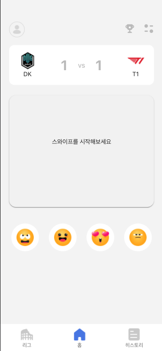
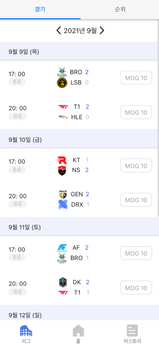
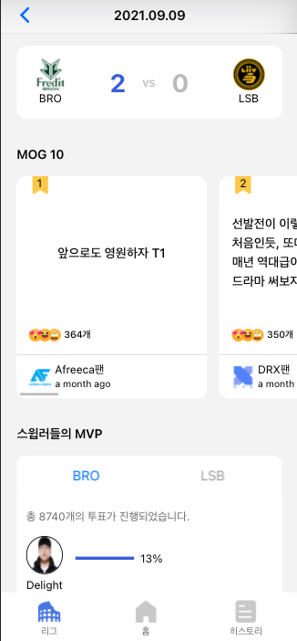
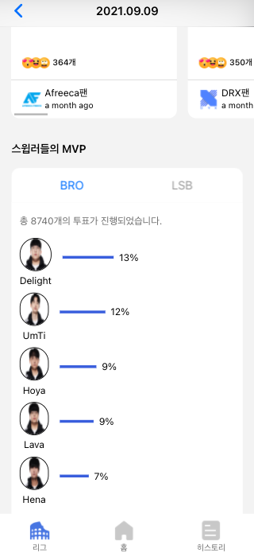
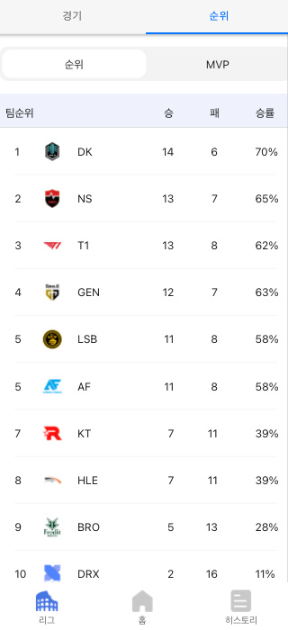
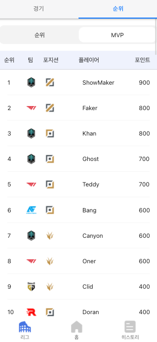

```
 ______   ____   ___    __  ___        __  ___   ____   __    ____   ____ ______  ____    _  __   ____
/_  __/  / __/  / _ |  /  |/  /       /  |/  /  /  _/  / /   / __/  / __//_  __/ / __ \  / |/ /  / __/
 / /    / _/   / __ | / /|_/ /       / /|_/ /  _/ /   / /__ / _/   _\ \   / /   / /_/ / /    /  / _/
/_/    /___/  /_/ |_|/_/  /_/       /_/  /_/  /___/  /____//___/  /___/  /_/    \____/ /_/|_/  /___/
```

프런트도 만들어보기

사용한 언어 및 프레임워크

```
언어: JS
프레임워크: Framework7-React
라이브러리: React-query, Tailwind, Recoil
```










